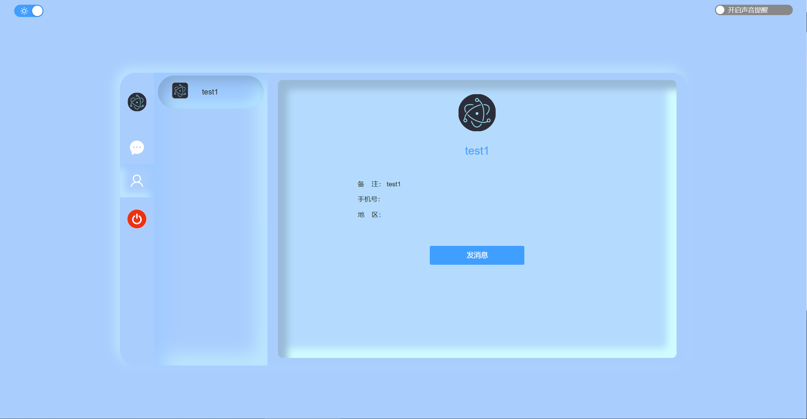
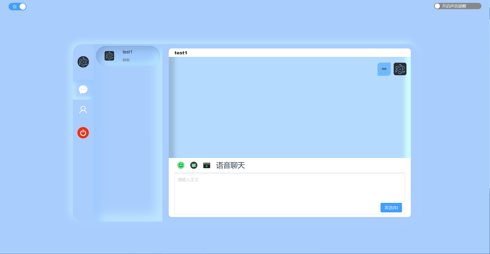

# im-chat-electron-simple
im chat electron simple webrtc 即时通讯 简单桌面端, webrtc语音，发送文字，图片，视频， nodejs后台 mysql数据库

## TODO 计划
1. TODO 界面美化
2. TODO 增加视频通话

## 界面预览
1. 
2. 
3. 

## 依赖
1. mysql8版本
2. nodejs 16版本以上

## 前端 chart-electron
1. 安装
```cmd
yarn 
```
2. 开发
```cmd
yarn dev
```
3. 编译
```cmd
yarn build:win
```
## 后台 char-service
1. 安装mysql8
2. 导入数据库`mysql.sql`

### 修改配置
1. 修改mysql配置
```js
const db = mysql.createConnection({
    host: "localhost",
    user: "root",
    password: "admin",
    database: "chatim"
})
```
2. 启动服务
```cmd
node app.js 
```

